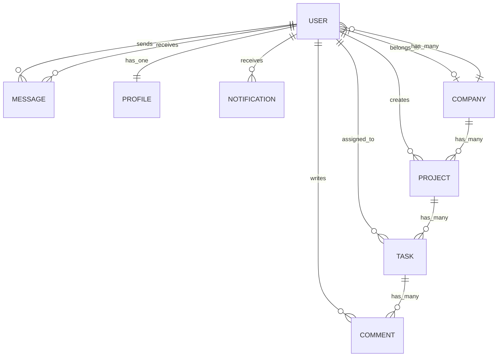

# 🧠 Project Management System for Teams

> A modern and collaborative platform for managing projects, tasks, and teams — built with Laravel.

[](https://opensource.org/licenses/MIT)
[](https://laravel.com)
[](https://www.php.net/)

---

## 📌 Overview

This is a full-featured **project management system** tailored for teams in business environments. It enables **task assignment**, **progress tracking**, **team collaboration**, and **company organization** in one centralized workspace. The application follows modern web development practices and leverages Laravel's powerful features to deliver a robust and scalable solution.

## 🚀 Core Features

### 👥 User Management
- 🔐 Secure authentication with Laravel Fortify
- 🎯 Role-based access control (Admin, Manager, Employee)
- 🔄 Social login integration (Google, GitHub, etc.)
- 👤 User profiles with detailed information
- 🔄 Email verification
- 🔒 Two-factor authentication

### 📁 Project Management
- 🏗️ Create and manage projects with deadlines
- 📊 Track project progress with visual indicators
- 🏷️ Categorize projects by status (Pending, In Progress, Completed)
- 📈 Project analytics and statistics
- 🔍 Advanced search and filtering

### ✅ Task Management
- ✏️ Create and assign tasks to team members
- 🗓️ Set due dates and priorities
- 📝 Add detailed descriptions and attachments
- 🔄 Update task status (Pending, In Progress, Done)
- 💬 Add comments and collaborate on tasks

### 💬 Team Collaboration
- 💬 Real-time in-app chat
- 📨 Internal messaging system
- 🔔 Instant desktop notifications
- 📝 Threaded task comments
- 👥 Team mentions and @mentions

### 🏢 Company & Teams
- 🏢 Manage company profiles
- 👥 Organize users into teams/departments
- 🔑 Department-level access control
- 📊 Company-wide analytics

## 🛠️ Tech Stack

| Layer          | Technology                                                                 |
|----------------|---------------------------------------------------------------------------|
| **Backend**   | Laravel 10.x, PHP 8.1+                                                    |
| **Frontend**  | Blade, Bootstrap 5, Alpine.js, jQuery                                     |
| **Database**  | MySQL 8.0+                                                               |
| **Auth**      | Laravel Fortify, Laravel Socialite, Sanctum                              |
| **Real-time** | Laravel Echo, Pusher/Socket.io                                            |
| **Caching**   | Redis/Memcached                                                          |
| **Queue**     | Laravel Queues with Redis/Beanstalkd                                      |
| **Storage**   | Local/Amazon S3                                                          |
| **Testing**   | PHPUnit, Laravel Dusk                                                    |
| **Deployment**| Laravel Forge, Envoyer, Docker                                           |

## 📊 Database Schema (ERD)



## 🚀 Getting Started

### Prerequisites

- PHP 8.1 or higher
- Composer
- Node.js & NPM
- MySQL 8.0+ or MariaDB
- Redis (for caching and queues)
- Pusher account (for real-time features)

### Installation

1. **Clone the repository**
   ```bash
   git clone https://github.com/yourusername/project-management-system.git
   cd project-management-system
   ```

2. **Install PHP dependencies**
   ```bash
   composer install
   ```

3. **Install NPM dependencies**
   ```bash
   npm install
   npm run build
   ```

4. **Configure environment**
   ```bash
   cp .env.example .env
   php artisan key:generate
   ```

5. **Update .env file**
   - Configure database connection
   - Set up mail server details
   - Configure Pusher credentials
   - Set up other necessary environment variables

6. **Run migrations and seeders**
   ```bash
   php artisan migrate --seed
   ```

7. **Link storage**
   ```bash
   php artisan storage:link
   ```

8. **Start the development server**
   ```bash
   php artisan serve
   ```

9. **Run queue worker (in a separate terminal)**
   ```bash
   php artisan queue:work
   ```

## 🧪 Testing

```bash
# Run PHPUnit tests
composer test

# Run browser tests (Dusk)
php artisan dusk
```

## 🔒 Security

- CSRF protection
- XSS prevention
- SQL injection prevention
- Secure password hashing
- Rate limiting
- Secure headers
- Content Security Policy (CSP)

## 📄 License

This project is open-source and available under the [MIT License](LICENSE).

## 🤝 Contributing

Contributions are welcome! Please read our [contributing guidelines](CONTRIBUTING.md) to get started.

1. Fork the repository
2. Create your feature branch (`git checkout -b feature/AmazingFeature`)
3. Commit your changes (`git commit -m 'Add some AmazingFeature'`)
4. Push to the branch (`git push origin feature/AmazingFeature`)
5. Open a Pull Request

## 📧 Contact

For inquiries or support, please contact [your-email@example.com](mailto:your-email@example.com).

---

*Last Updated: 2025-08-06*
